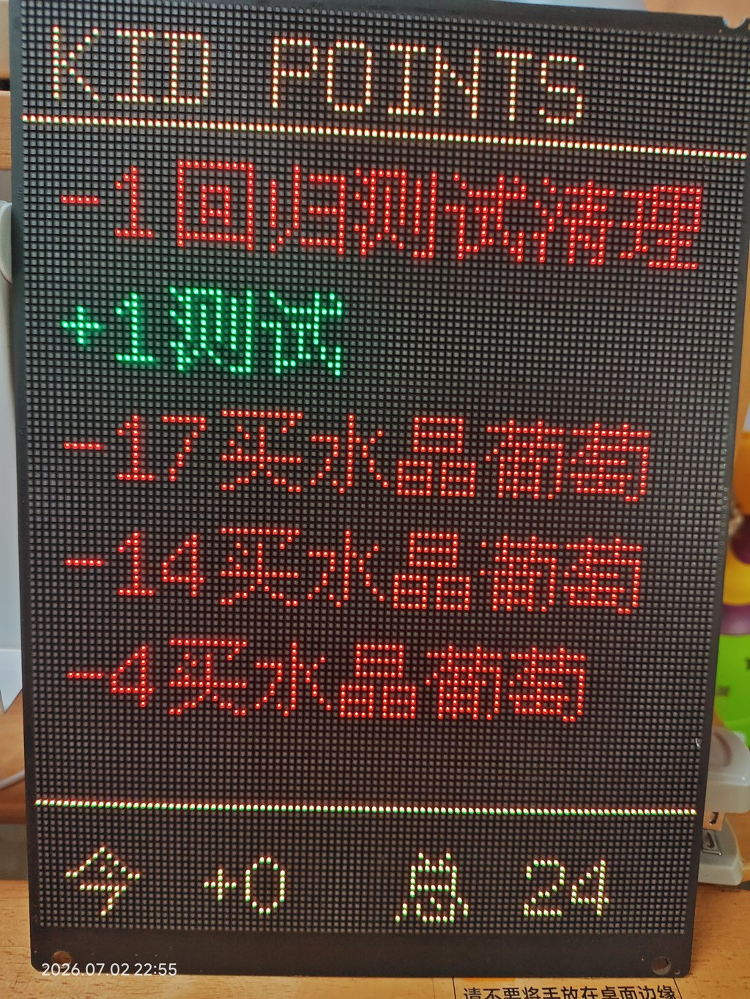

# 桌面积分看板 📺

> **一个抛砖引玉的桌面硬件 demo。**
> 把 kids-points-v2 的积分数据，投到桌上一块 96×128 的 LED 矩阵屏上。

**这不是产品**——是一个家长（老王）为了让孩子随时在桌面看到自己的积分，临时攒出来的硬件实验。如果你也想做一块，可以把它当参考，但不建议 1:1 照抄。

> 📦 **完整源码**（ESP32 固件 / systemd service 文件 / 烧录说明）在 GitHub 仓库：
> <https://github.com/cowboy231/kids-points-v2/tree/main/extensions/dashboard>
>
> ClawHub 上是**核心 skill 包**，不含 ESP32 `.ino` 固件源码（ClawHub 不接受这种 content type）。
> 用户从 GitHub 取 `extensions/dashboard/code/esp32/` 后自行烧录。

---

## 🎯 它能干什么

```
KID POINTS
━━━━━━━━━━━━
+2  口算题卡全对
+3  跳绳 500 个
+1  整理书桌
+5  帮妈妈刷碗
-5  看动画片超时
━━━━━━━━━━━━
今  +2    总  77
```

- **标题**：`KID POINTS`（顶部居中）
- **流水**：最近 5 条积分变化（带 emoji 符号）
- **底栏**：今日净变化 + 总余额

数据每 5 秒从本地 server 拉一次，不联网，不上传，纯本地。

### 实物图（96×128 HUB75 LED 矩阵屏）



> 这是 2026-07-02 22:55 在 11 寸 HUB75 LED 屏上的实拍图。
> 红+绿双色渲染：红色数字 + 绿色 ✓ 标识，底部 sparkline 显示最近 7 日积分趋势。
> **文中"买冰棍"等是真实生活交易，仅供 demo 示意。**

---

## 🔧 硬件清单（~160 元）

| 物料 | 型号/规格 | 数量 | 来源 |
|------|-----------|------|------|
| ESP32 主控板 | **ESP32 DevKit v1（CH340 USB-Serial）** | 1 | 淘宝 |
| LED 矩阵屏 | **HUB75 P2 96×64（1/32 扫，单色琥珀）** | 2 | 淘宝 |
| 信号线 | **HUB75 16P 杜邦线（母对母 30cm）** | 2 | 淘宝 |
| 电源 | **5V 4A DC 适配器（DC 5.5×2.1 母头）** | 1 | 淘宝 |

**为什么是这个组合？**

- ESP32 DevKit v1 是因为便宜（~30 元）且 GPIO 足够多（需要 ~12 根输出驱动 LED 屏）
- HUB75 P2 96×64 是因为淘宝现货、价格合适（~50 元/块），两块垂直拼成 96×128 刚好显示 5 行流水
- 单色琥珀是因为价格敏感 + 护眼（零蓝光），不需要 RGB 全彩

---

## 🏗️ 架构（3 层）

```
┌─────────────────────────────────────────────────┐
│  Layer 3: ESP32 + LED 矩阵屏                    │
│  (5 秒拉数据 → memcmp 比对 → 智能渲染)           │
├─────────────────────────────────────────────────┤
│  Layer 2: Flask Server (:8080)                  │
│  (in-memory cache, 防 CLI 重复调用)              │
├─────────────────────────────────────────────────┤
│  Layer 1: kids-points-v2 SQLite (cli.py)        │
│  (唯一数据源)                                     │
└─────────────────────────────────────────────────┘
```

---

## 🚀 5 分钟上手

### 1. 启动 Server

```bash
cd extensions/dashboard/code/server
pip install flask watchdog
python3 server.py
```

验证：
```bash
curl http://localhost:8080/api/health
curl http://localhost:8080/api/dashboard | python3 -m json.tool
```

### 2. 烧录 ESP32

```bash
# 安装库
arduino-cli lib install "ESP32 HUB75 LED MATRIX PANEL DMA Display"
arduino-cli lib install "U8g2 for Adafruit GFX"
arduino-cli lib install "ArduinoJson"
arduino-cli lib install "Adafruit GFX Library"

# 编译
arduino-cli compile --fqbn esp32:esp32:esp32 code/esp32/desktop/

# 烧录（⚠️ 用 esptool，不要用 arduino-cli upload）
esptool --chip esp32 --port /dev/ttyUSB0 --baud 921600 \
  write_flash 0x10000 code/esp32/desktop/desktop.ino.bin

# 烧完按 ESP32 板上的 EN 按钮复位
```

### 3. 接线

HUB75 16P ↔ ESP32 GPIO：

| HUB75 | ESP32 | HUB75 | ESP32 |
|-------|-------|-------|-------|
| R1 | 14 | A | 13 |
| G1 | (空) | B | 15 |
| B1 | (空) | C | 2 |
| GND | GND | D | 4 |
| R2 | 25 | E | 16 |
| G2 | (空) | CLK | 17 |
| B2 | (空) | LAT | 5 |
| GND | GND | OE | 18 |

**⚠️ 电源**：ESP32 USB 单独供电，HUB75 必须接 5V 4A 独立电源（USB 500mA 不够，峰值 2A）。共地。

---

## ❓ FAQ

### Q: ESP32 和 LED 屏之间要接多少根线？
A: 至少 12 根（单色屏：R1 + R2 + A/B/C/D/E + CLK/LAT/OE + GND）。RGB 全彩需要 16 根。

### Q: 烧录后用 `arduino-cli upload` 还是 `esptool`？
A: **用 `esptool`**。`arduino-cli upload` 会擦除 NVS（WiFi 密码存储区），导致 ESP32 忘密码。`esptool` 只写 0x10000 位置，不动 NVS。

### Q: 屏不亮怎么办？
A: 90% 是电源问题。检查：5V 4A 接 HUB75 了吗？USB 单独给 ESP32 了吗？共地了吗？如果电源没问题，按 EN 按钮复位试试。

### Q: 花屏/乱码怎么办？
A: 先跑 `fill_test.ino` 看色块位置是否和物理屏一致。如果不对，改 `mxconfig.gpio.e = 16`（1/32 扫必须有 E pin）。

### Q: 中文字符显示成方块？
A: 字库要选 `gb2312b`（v4.7+），不要 `chinese3`。GB2312 一级字库覆盖 ~90% 日常中文。

### Q: 两块屏怎么拼？
A: 物理上垂直拼接（上下），用 HUB75 16P 排线对接。软件上设 `#define PANEL_CHAIN 2` 和 `#define NUM_ROWS 2`。如果上下颠倒，改 `#define TOPDOWN true`。

### Q: 护眼红线？
A: LED 蓝光（~470nm）直接伤眼。这个 demo 用单色琥珀屏（RGB565 B 通道 = 0），硬件层零蓝光。如果改成全彩屏，所有颜色必须满足 `B=0`，否则编译报错（`#error`）。

### Q: 没有 LED 屏怎么预览？
A: `code/sim/desktop_sim.py` 是 pygame 仿真，可以调字号、排版、看效果，不通硬件。

---

## 📁 目录结构

```
extensions/dashboard/
├── README.md              # ← 你在这里
├── code/
│   ├── esp32/             # ESP32 固件
│   │   ├── desktop/       # 主程序（v5.3, ~496 行）
│   │   ├── wifitest/      # NVS 重建脚本
│   │   └── fill_test/     # 店家色块测试
│   ├── server/            # Flask Server
│   │   ├── server.py      # 主服务 (:8080, in-memory cache)
│   │   └── data_source.py # V2 CLI 包装
│   └── sim/               # pygame 仿真（无硬件预览）
└── docs/                  # 设计/架构/硬件/验证文档
```

---

## ⚠️ 注意事项

1. **这不是开源硬件项目**——固件没有独立仓库，电路图没有，原理图也没有。这只是老王的实验产出。
2. **CH340 USB-Serial 有死锁问题**——烧录失败时完全拔 USB 30 秒+再插。
3. **烧完必须按 EN 按钮复位**——esptool 不会自动重启 ESP32。
4. **亮度可调**：改 `const uint8_t BRIGHTNESS = 50;`（0=全暗，255=拍照级，50=夜间柔和）。

---

_一块屏，让孩子每天看见自己的进步。_ 🌟